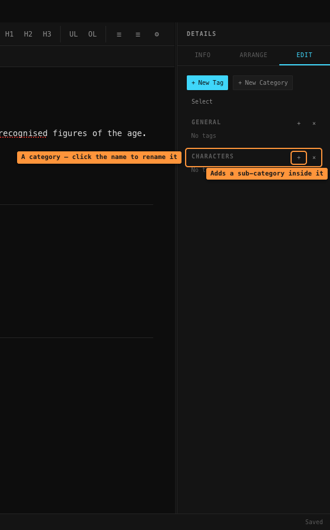
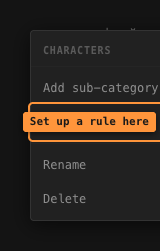
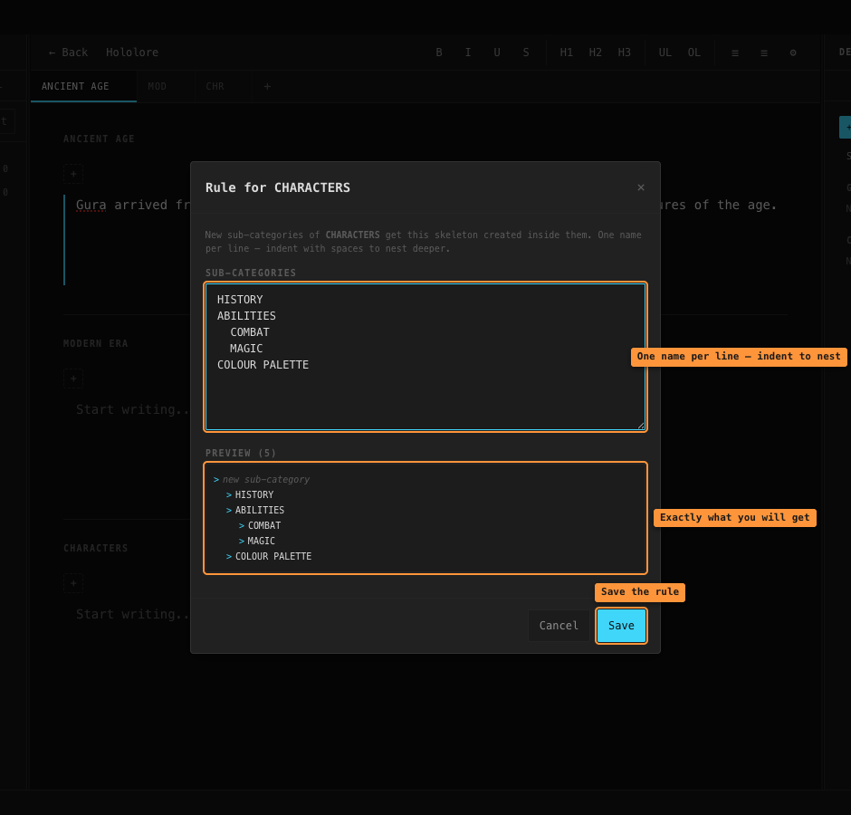
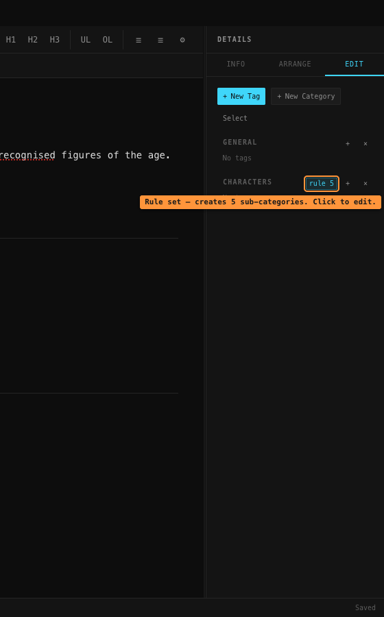
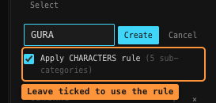
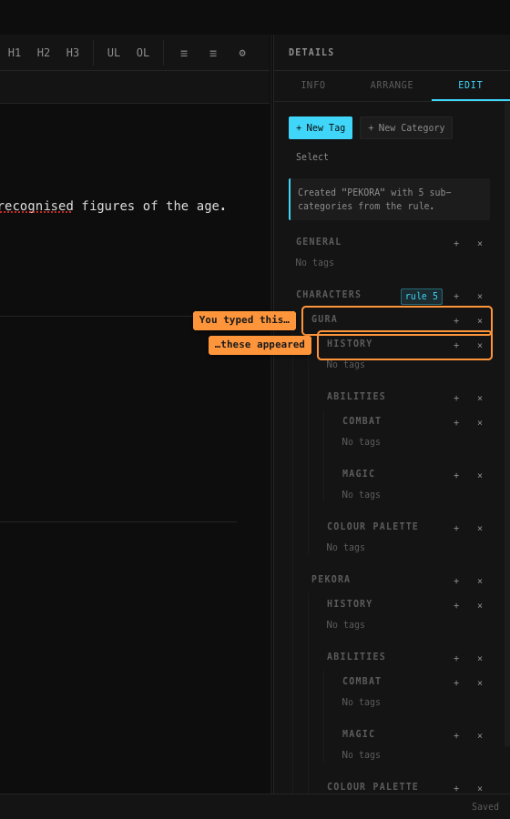
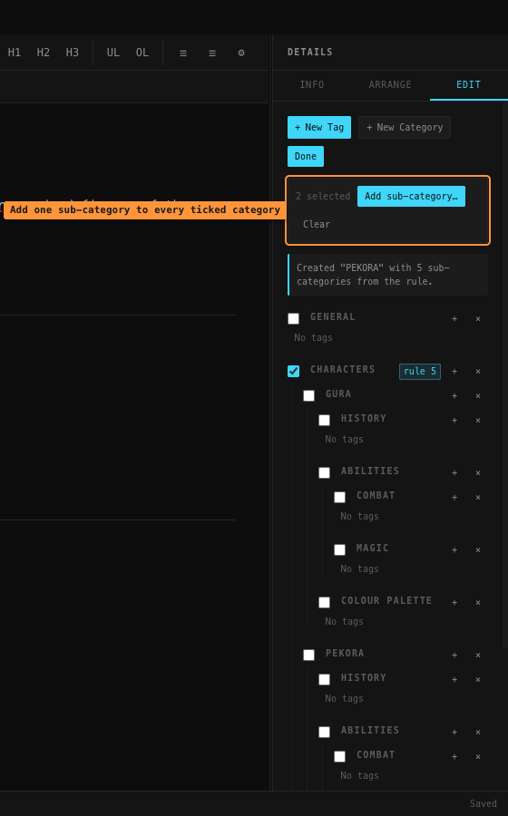
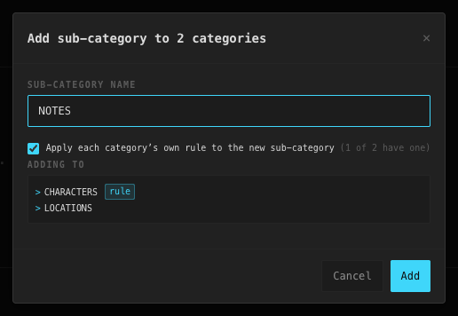

# Categories and rules

## What a category is

A **category** is a folder for your tags. Categories can sit inside other categories, so
you can build whatever structure your world needs:

```
CHARACTERS
  GURA
    HISTORY
    ABILITIES
    COLOUR PALETTE
  PEKORA
    HISTORY
    ABILITIES
    COLOUR PALETTE
```

Typing that same list out by hand for every single character gets old fast. That is what
**rules** are for.

## What a rule is

A **rule** belongs to one category. It is a list of sub-categories that get created
automatically inside **every new sub-category you add to it**.

Put a rule on `CHARACTERS` saying *HISTORY, ABILITIES, COLOUR PALETTE* — and from then on,
every new character you add under `CHARACTERS` arrives with those three already inside it.
You type `GURA`, you get `GURA` plus its three sub-categories. You type `PEKORA`, same
again.

That's the whole idea. The rest of this page is where the buttons are.

---

## Finding the category panel

Open a document, then click the **Edit** tab on the right-hand side.



> The right-hand panel only exists while a document is open. If you are looking at the
> Documents screen there is no Edit tab at all — open or create a document first.

On this panel:

- **`+ New Category`** makes a new top-level category.
- **`+`** on any row makes a sub-category inside that row.
- **Clicking a category's name** lets you rename it.
- **`×`** deletes it.

## Step 1 — create the outer category

Click **`+ New Category`**, type `CHARACTERS`, press **Create**.

## Step 2 — give it a rule

**Right-click** the `CHARACTERS` row. A menu appears:



Choose **Create rule…**

Type one sub-category per line. To nest something deeper, indent it with spaces:



The **Preview** underneath updates as you type and shows exactly what you are going to
get. When it looks right, press **Save**.

A rule can hold up to 200 sub-categories, nested up to 10 levels deep. The indenting does
not have to be neat — two spaces, four spaces or a tab all work, as long as a child is
indented further than the thing above it.

### The rule badge

Once a category has a rule, a small orange-outlined badge appears on its row:



**`rule 5`** means "this category has a rule, and it creates 5 sub-categories". The number
counts everything, including nested entries — the rule above shows `rule 5` because
`COMBAT` and `MAGIC` count too, not just the three top-level names.

**Click the badge to edit the rule.** That's the quickest way back in.

## Step 3 — use it

Click **`+`** on the `CHARACTERS` row and type `GURA`. A tickbox appears:



It is **already ticked**, so you can just press **Create**. Untick it if you want a plain
sub-category with nothing inside it, just this once.

Press Create, and there it is — `GURA` with the whole skeleton inside. Add `PEKORA` next
and it gets exactly the same set:



---

## Changing a rule later

Click the **`rule N`** badge, or right-click the category and choose **Edit rule…**

Changing a rule does **not** go back and change sub-categories you already made. For that,
see the next section.

## Applying a rule to things you already made

Made the rule *after* you had already added a few characters? Right-click the category and
choose **Apply rule to existing sub-categories**.

This only adds what is missing. Anything already there is left alone, contents and all —
so it is safe to run twice. If there is nothing to do, it tells you so.

There is also a **Save & apply to N existing sub-categories** button inside the rule
editor, which saves your changes and applies them in one go.

## Removing a rule

Open the rule editor and press **Remove rule**. (Deleting all the text and saving does the
same thing.)

Removing a rule does **not** delete the sub-categories it already created — those are just
ordinary categories now.

## Adding one sub-category to lots of categories at once

Press **Select** at the top of the panel. Tickboxes appear next to every category:



Tick the ones you want, then press **Add sub-category…**



Type the name and press **Add**. There is also an option to fire **each category's own
rule** on the new sub-category, so `CHARACTERS` and `LOCATIONS` can each stamp their own
skeleton.

Anything that already has a sub-category by that name is skipped, and you are told which.

---

## Three things worth knowing

**A rule only fires one level down.** A rule on `CHARACTERS` runs when you add something
directly inside `CHARACTERS`. It does not keep cascading downwards forever. If you want
`GURA`'s sub-categories to get a skeleton too, give `GURA` its own rule.

**Two things in the same place can't share a name** (capital letters don't count as a
difference) — you can't have two `HISTORY` entries inside `GURA`. But `GURA` and `PEKORA`
can both contain a `HISTORY`, which is the entire point.

**Deleting a category deletes everything inside it** — sub-categories, their tags, and any
highlights using those tags. The confirmation box tells you the numbers before you commit.
