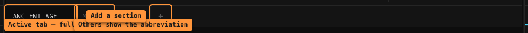
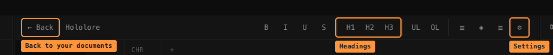
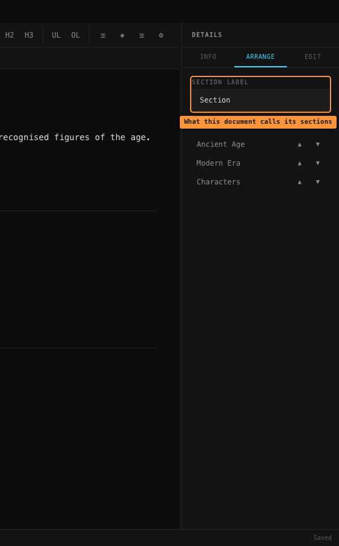
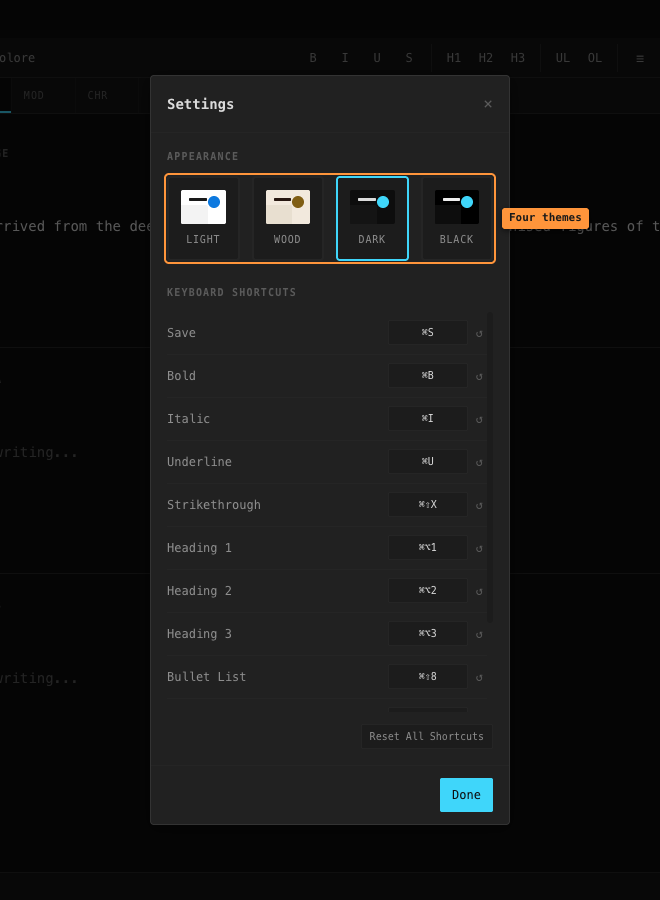

# Documents and sections

A **document** is one body of work — a world, a campaign, a story. Each document is split
into **sections**, which are the chunks inside it: eras, chapters, characters, whatever
suits you.

## The Documents screen

Every document you've made appears here as a tile, newest first. The dashed tile makes a
new one.

Each tile shows the title, the description if you gave one, a date, and a **Delete** link.

> **Delete has no "are you sure?".** One click and the document and all its sections are
> gone, with no undo. The link sits right next to the date and looks just as quiet, so
> take care.

> The date on a tile is the date the document was *created*, not when you last wrote in
> it. Editing your text doesn't update it.

## Making a document

- **Title** — required. If you leave it empty the Create button just silently does nothing.
- **Description** — optional, shown on the tile.

> **Choose the title carefully.** There is currently no way to rename a document or change
> its description afterwards.

## Making a section

Click the **`+`** at the right end of the tab bar.

- **Title** — required, e.g. `Ancient Age`.
- **Abbreviation** — optional, max 5 characters. This is what shows on the tab when that
  section isn't the one you're looking at.

Leave the abbreviation blank and it gets made up from the title: `Ancient` → `ANC`,
`Ancient Age` → `AA`.

> **Check the abbreviation before pressing Create.** It tries to fill itself in as you
> type but only catches your first keystroke, so typing `Ancient Age` leaves it showing
> just `A`. Either clear the box (it then fills in properly) or type what you want.

> **Sections can't be renamed afterwards** either, same as documents.

## The tab bar

- The section you're currently in shows its **full title**.
- All the others show their **abbreviation**.
- **`+`** adds a section.
- Hover a tab and a small **`×`** appears to delete that section — again with **no
  confirmation**, and it takes that section's highlights with it.

## How sections are laid out

Every section is on **one long scrolling page**, one after another — not one at a time.

Clicking a tab scrolls to that section, and scrolling the page moves the highlighted tab
to match. They stay in step.

## The toolbar

Bold, italic, underline and strikethrough; three heading levels; bullet and numbered
lists; the sidebar toggles; **◈** for the [graph view](filing-and-graph.md#the-graph);
and the gear for [Settings](#settings). The formatting buttons only appear once you've clicked into a
section.

## Reordering sections, and the section label

Both live in the **Arrange** tab on the right.

**Section Label** is what *this document* calls its sections — "Chapter", "Era",
"Character", anything. It saves as you type. It only ever shows up in the status bar at
the bottom of the window.

Underneath, each section has **▲** and **▼** buttons that move it one place up or down.
There's no drag and drop, and no undo, but the change is saved straight away and reorders
both the tabs and the page.

## Saving

There is no save button and no save shortcut, because there's nothing to save by hand.
Your writing is stored automatically about a second after you stop typing.

The bottom right says **Saved** or **Saving...**.

> Because it waits a second, leaving a document *immediately* after typing can lose that
> last edit. Give it a moment before pressing **← Back** or quitting.

## Settings

The gear button in the toolbar. There are four themes, and a list of keyboard shortcuts.

> Settings can only be reached from inside a document — there's no gear on the Documents
> screen.

See [Keyboard shortcuts](keyboard-shortcuts.md) for what actually works, and an important
caveat about the rebinding list.
