# Documents and sections

A **document** is one body of work — a world, a campaign, a story. Each document is split
into **sections**, which are the chunks inside it: eras, chapters, characters, whatever
suits you.

## The Documents screen

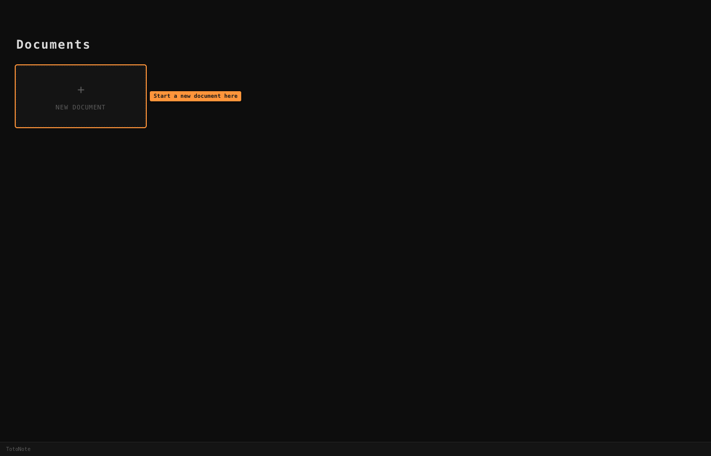

Every document you've made appears here as a tile, newest first. The dashed tile makes a
new one.

Each tile shows the title, the description if you gave one, a date, and a **Delete** link.

> Deleting a document asks you to confirm first, and takes all of its sections and
> highlights with it. It cannot be undone.

> The date on a tile is the date the document was *created*, not when you last wrote in
> it. Editing your text doesn't update it.

## Making a document

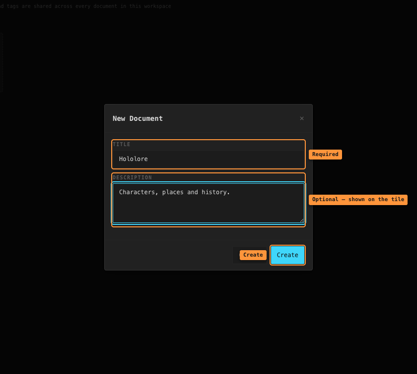

- **Title** — required. If you leave it empty the Create button just silently does nothing.
- **Description** — optional, shown on the tile.

Both can be changed later — open the **Arrange** tab and click the title.

## Making a section

Click the **`+`** at the right end of the tab bar.

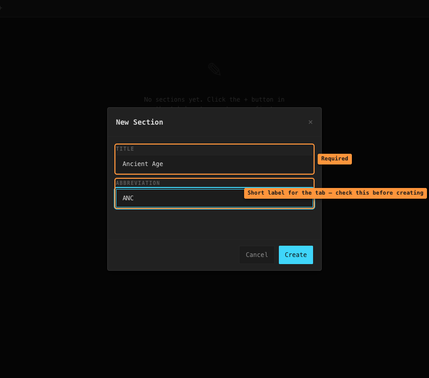

- **Title** — required, e.g. `Ancient Age`.
- **Abbreviation** — optional, max 5 characters. This is what shows on the tab when that
  section isn't the one you're looking at.

Leave the abbreviation blank and it gets made up from the title: `Ancient` → `ANC`,
`Ancient Age` → `AA`.

> **Check the abbreviation before pressing Create.** It tries to fill itself in as you
> type but only catches your first keystroke, so typing `Ancient Age` leaves it showing
> just `A`. Either clear the box (it then fills in properly) or type what you want.

Sections can be renamed the same way, in the **Arrange** tab.

## The tab bar

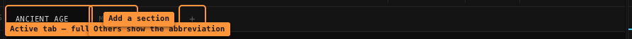

- The section you're currently in shows its **full title**.
- All the others show their **abbreviation**.
- **`+`** adds a section.
- Hover a tab and a small **`×`** appears to delete that section. It asks you to confirm
  first (a section can hold a lot of writing), takes that section's highlights with it, and
  still shows an **Undo** button for a few seconds afterwards if you change your mind.

## How sections are laid out

Every section is on **one long scrolling page**, one after another — not one at a time.

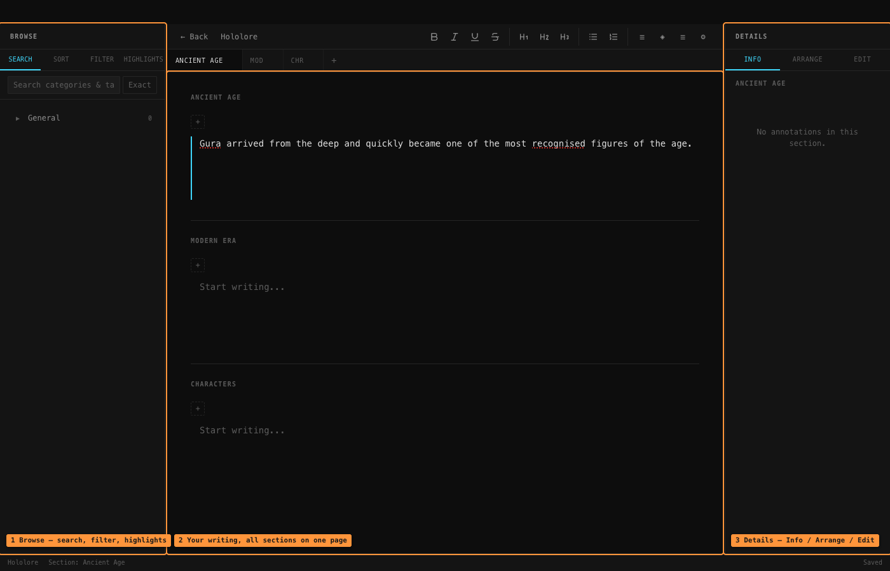

Clicking a tab scrolls to that section, and scrolling the page moves the highlighted tab
to match. They stay in step.

## The toolbar

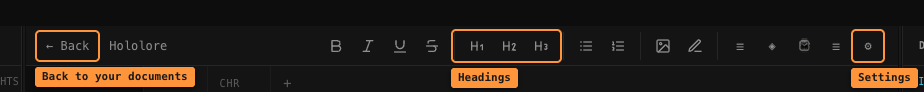

Bold, italic, underline and strikethrough; three heading levels; bullet and numbered
lists; the sidebar toggles; **◈** for the [graph view](filing-and-graph.md#the-graph);
and the gear for [Settings](#settings). The formatting buttons only appear once you've clicked into a
section.

## Reordering sections, and the section label

You can also **double-click the divider** between a sidebar and the editor to snap that
sidebar back to its default width.

Both live in the **Arrange** tab on the right.

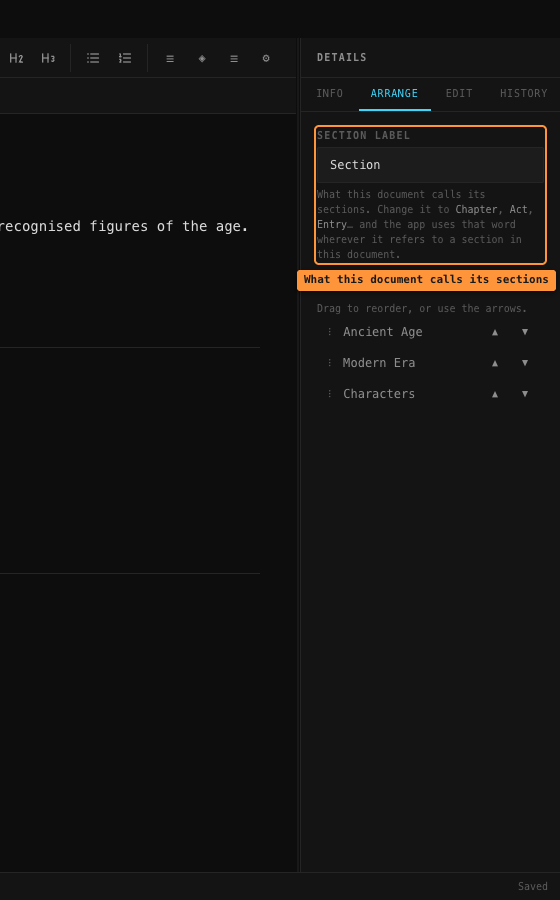

At the top of the tab, **click the document's title to rename it**, and click any section's
name in the list below to rename that.

**Section Label** is what *this document* calls its sections — "Chapter", "Era",
"Character", anything. Change it here and the app uses that word wherever it refers to a
section in this document. It saves as you type.

Underneath, **drag a section by its grip** to reorder it, or use the **▲** and **▼**
buttons to move it one place at a time. Either way the change saves straight away and
reorders both the tabs and the page.

## Pictures

Paste or drag an image straight into a section — a character reference, a map, a piece of
concept art. Supported: PNG, JPEG, WebP, GIF and AVIF.

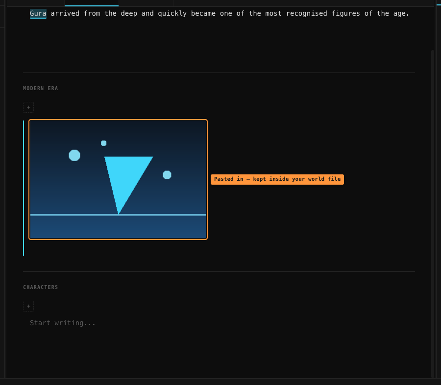

Images are kept **inside your database file**, not as loose files next to it, so copying
`totonote.db` still takes your whole world with it. Anything larger than 2000px on its
longest edge is scaled down once as it comes in, so a folder of concept art doesn't turn
your world into a several-gigabyte file. Animated GIFs are stored untouched.

**Drag the corner handle** to size a picture — small for a portrait, wide for a map. The
size is remembered.

**The words inside a picture are searchable.** Shortly after you add an image, TotoNote
reads any text in it — labels on a map, a name on a character sheet — so searching finds
the picture even though the words only exist as pixels. It happens in the background and
needs no internet.

> Because the image is copied into the database, editing the original file afterwards
> won't change what TotoNote shows.

### Pictures on wiki pages

An image can be tagged and filed like any other excerpt: click it to select it, then use
the **Tag** button as usual and pick a category under **File under…**. It then appears on
that category's compiled page — which is how a character's portrait ends up at the top of
their page.

See [Filing and the graph](filing-and-graph.md) for how filing works.

## Drawing

The **✎** button in the toolbar adds a drawing surface. Select an image first and it draws
*on top of that image* instead — for putting arrows on a map, circling a region, or
labelling a floorplan.

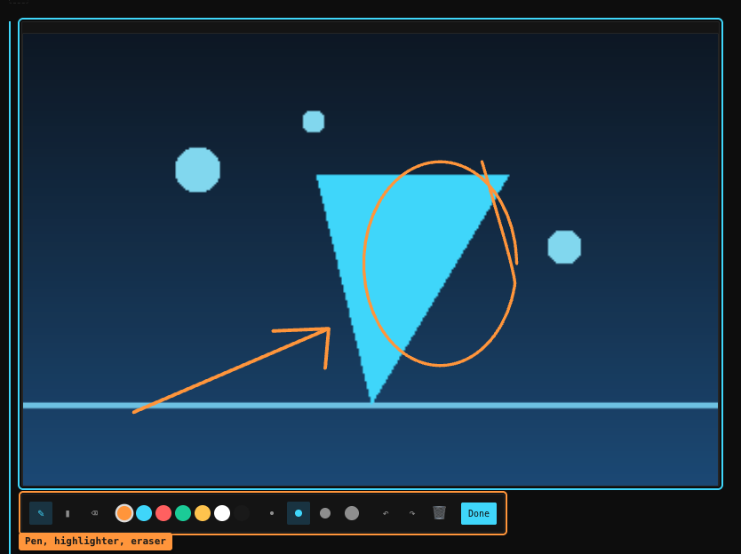

Press **Draw** under the surface to pick up the pen; press **Done** when you've finished.
While you're drawing you get:

- **Pen** — pressure-sensitive if you're using a graphics tablet. Press harder for a
  thicker line. A mouse or trackpad draws at an even width.
- **Highlighter** — translucent, for shading an area without hiding what's under it.
- **Eraser** — removes a whole stroke wherever you touch it, rather than rubbing away
  pixels. Quicker, and usually what you meant.
- Colours, four nib sizes, **undo** and **redo** for the drawing itself, and **clear**.

Strokes are stored as lines rather than as a picture, so a drawing stays sharp at any size,
takes almost no space, and stays lined up with the image underneath however the page is
resized.

> The drawing's undo is separate from the editor's. **⌘Z** undoes your *typing*; the arrows
> in the drawing tools undo your *strokes*.

> This is for marking things up, not for making art — a proper drawing program will always
> be better at that. Draw there, then paste the result in as a picture.

## Saving

By default your writing is stored automatically about a second after you stop typing —
no save button needed.

If you'd rather save by hand, turn **Auto-save** off in **Settings**. Then your changes
wait until you press **⌘S / Ctrl+S** (or the **Save** button that appears in the status
bar).

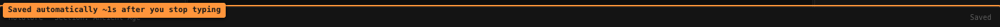

The bottom right says **Saved** / **Saving…**, or **● Unsaved** with a **Save** button when
auto-save is off and you have pending changes.

**Leaving a document always saves it** — pressing **← Back**, opening another document or
switching workspace writes your changes out first, whichever mode you're in. Auto-save
decides whether TotoNote saves *while you type*, not whether your work survives closing
something.

The one exception is quitting, where you get asked instead: with unsaved changes, TotoNote
offers **Save**, **Don't Save** or **Cancel** before it closes.

## History

The **History** tab (in the Details sidebar) keeps a timeline of checkpoints for the
section you're editing — automatic snapshots taken a moment after you pause.

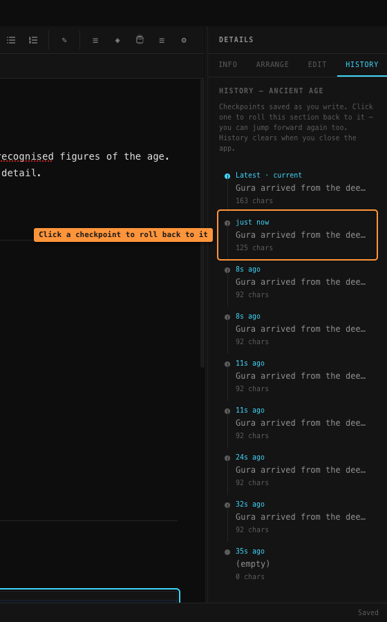

Click any checkpoint to roll the section back to that state. The whole timeline stays put,
so you can jump forward again just as easily — it's more forgiving than plain undo, which
throws the "future" away the moment you make a new edit.

> History is per-session: it's there while the app is open and clears when you close it.
> For a permanent record, the text itself is always saved.

## Settings

The gear button in the toolbar — or **TotoNote → Settings…** (**⌘,**) on macOS, which also
works on the Documents screen. It holds:

- **Startup** — whether the opening animation plays. Turn it off to go straight to your
  documents.
- **Appearance** — four themes, plus **System**, which follows whether your computer is set
  to light or dark and keeps following it.
- **Editing** — the **Auto-save** toggle (see [Saving](#saving), above).
- **History** — how often a checkpoint is taken, from every pause up to every 10 seconds.
- **Backup** — save your whole world to one file, or restore one.
  → [Backup and restore](backup-and-restore.md)
- **Storage** — how much space embedded pictures use, and a button to reclaim what nothing
  points at any more. Pictures from a deleted section are kept so an undo can restore them,
  so this is the way to clear them out once you're sure.
- **Keyboard shortcuts**.

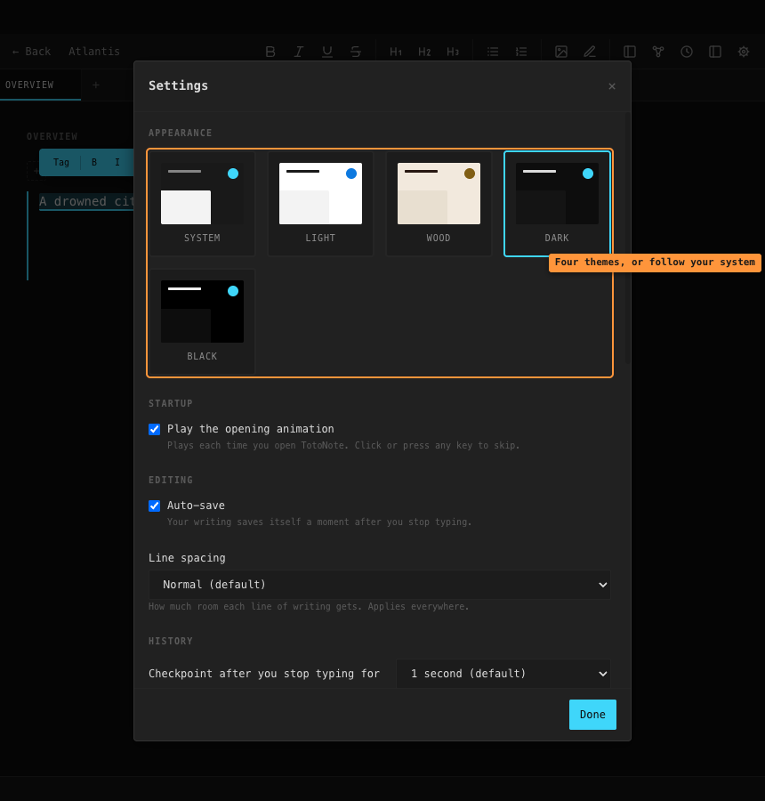

On macOS it's also under **TotoNote → Settings…** (**⌘,**), which works anywhere — including
the Documents screen, where there's no toolbar to click.

See [Keyboard shortcuts](keyboard-shortcuts.md) for what actually works, and an important
caveat about the rebinding list.

## Pointing one document at another

Type `[[` while writing and pick a document from the list — that inserts a link you can
click to jump there, and the document you linked to gains a **Linked from** entry pointing
back. Renaming a document updates every link to it automatically.

→ [Links and the timeline](links-and-timeline.md)
