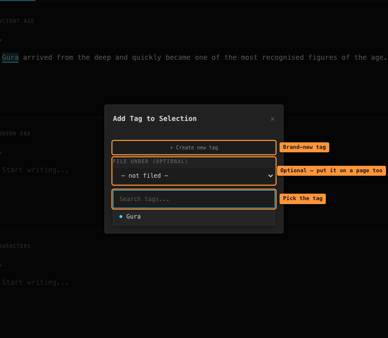
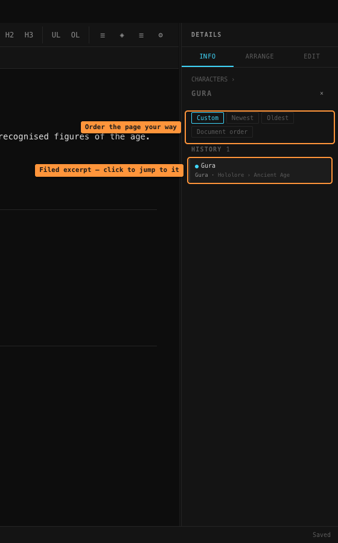
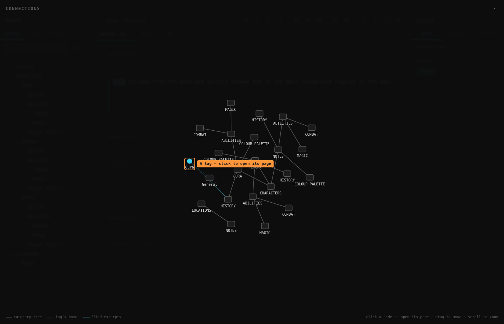

# Filing and the graph

Tags say what a piece of text is *about*. **Filing** says where it *belongs* — which page
of your world's wiki it should appear on. Together they turn your categories from empty
folders into pages that fill themselves as you write.

## The idea

Say you've written:

> *Gura was born in Atlantis.*

You select it and tag it **Gura** — that's what it's about. But in your world's structure,
this sentence is a piece of Gura's *history*, so you also file it under
`CHARACTERS > GURA > HISTORY`.

Do that as you write, and the `GURA` category becomes a compiled page: a HISTORY section,
an ABILITIES section, each collecting every excerpt you've filed there — pulled from
anywhere in any document.

Filing is always optional. An unfiled annotation is just a highlight, exactly as before.

## Filing while you tag

The **Add Tag to Selection** box has a **File under** dropdown. Pick a category before
choosing the tag, and the new highlight is filed in one step:

Leave it on *— not filed —* to just tag.

## Filing an existing highlight

Right-click any highlight → **File under…** — choose a category, or set it back to
*not filed*. Refiling moves the excerpt to the end of its new page.

## Reading a category's page

Click a **category's name** in the left sidebar (Search mode) — the name, not the row;
the row expands and collapses as before. Its page opens in the Info tab:

- Excerpts filed **directly** on this category come first.
- Each **sub-category** with filed excerpts appears as its own section — click its
  heading to drill into that page. The breadcrumb at the top takes you back up.
- Every excerpt shows its source (*document › section*). **Click it to jump to that text**,
  even if it lives in another document.

### Ordering a page

The sort bar at the top of a page offers:

- **Custom** — your own order. **Drag excerpts** into the order you want, or use the
  ▲ / ▼ buttons beside each one. The order is saved and is completely independent of
  where the text sits in your documents.
- **Newest** / **Oldest** — by when the excerpt was filed.
- **Document order** — the order the text appears in your writing.

## Reading a tag's page

Click a tag anywhere in the left sidebar. Its page in the Info tab now groups every
excerpt by **where it's filed** — a HISTORY group, an ABILITIES group, and a *Not filed*
group for plain highlights. It spans all documents, and each group heading opens that
category's own page.

## The graph

The **◈** button in the toolbar opens **Connections** — the whole structure drawn as one
map:

| Line | Meaning |
|------|---------|
| solid grey | the category tree — parent to child |
| dashed | a tag's home — the category it lives in |
| **cyan** | filings — this tag's excerpts appear on that page |

The cyan lines are the interesting ones: they cut across the tree and show where your
writing actually landed. A thick line means many excerpts.

- **Click** any node to open its page.
- **Drag** a node to rearrange, **drag the background** to pan, **scroll** to zoom.
- **Escape** or **×** closes it.

## Worth knowing

**Filing and the tag are independent.** You can file a `Gura`-tagged sentence under a
`LOCATIONS` page if that's where it belongs. The tag records the subject; the filing
records the shelf.

**One home per excerpt.** An annotation is filed in exactly one place (or none). To have
the same sentence on two pages, add a second tag to it and file that one elsewhere.

**Deleting a category never deletes your text.** Excerpts filed under it just become
unfiled; the highlights and the writing stay.

**Category rules pair well with this.** Give `CHARACTERS` a rule
([Categories and rules](categories-and-rules.md)) and every new character arrives with
its page sections ready to receive filings.
