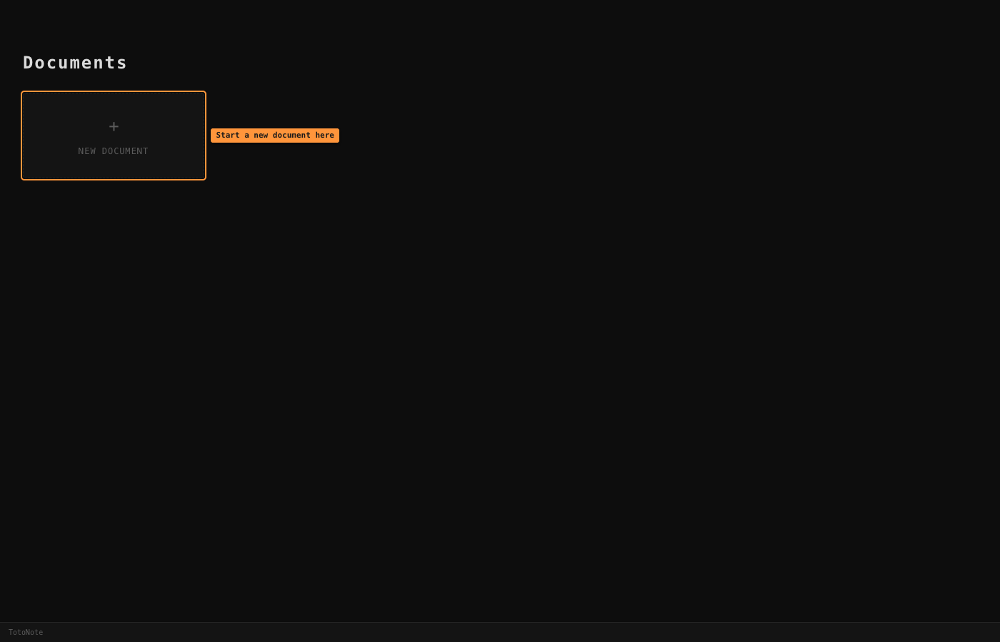
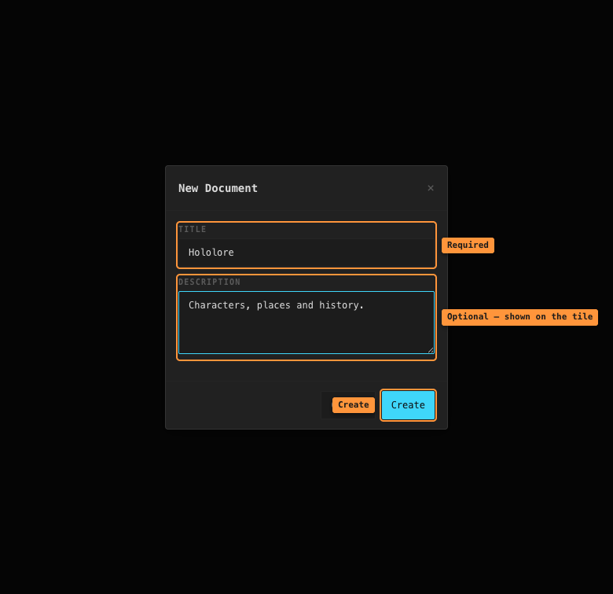
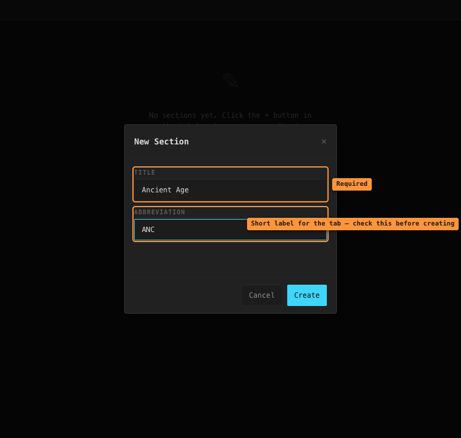
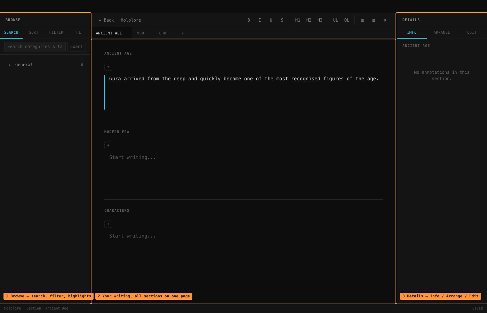
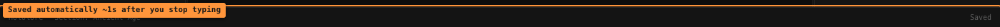

# Getting started

## Installing

Download a build for your system from the
[Releases page](https://github.com/bernisnukic/totonote/releases).

The builds aren't code-signed yet, so your operating system will warn you the first time
you open the app:

- **macOS** — right-click the app → **Open**, then confirm. The macOS build is for Apple
  Silicon (M1 and later).
- **Windows** — on the SmartScreen prompt, click **More info → Run anyway**.
- **Linux** — `sudo dpkg -i totonote_*.deb` or `sudo rpm -i totonote-*.rpm`.

## Your first document

When TotoNote opens you'll see the **Documents** screen — a grid with one dashed
**New Document** tile.

Click it and fill in:

- **Title** — required. The Create button quietly does nothing if this is empty.
- **Description** — optional, shown on the document's tile.

Press **Create** and the document opens straight away.

> Pick the title carefully. **There's currently no way to rename a document** or change its
> description after it's created.

## Adding your first section

A new document is empty and says so. Sections are the chunks a document is divided into —
eras, chapters, characters, whatever suits your world.

Click the **`+`** at the right end of the tab bar and fill in:

- **Title** — required, e.g. `Ancient Age`.
- **Abbreviation** — optional, up to 5 characters. This is what shows on the section's tab
  when it isn't the active one.

If you leave the abbreviation blank it's generated from the title — `Ancient` becomes
`ANC`, `Ancient Age` becomes `AA`.

> The abbreviation box tries to fill itself in as you type, but it only catches your first
> keystroke — type `Ancient Age` and you'll be left with just `A`. Either clear the box
> before pressing Create (it then generates properly) or type the abbreviation you want.
>
> Like documents, **sections can't be renamed after they're created.**

Now click into the page and start writing.

## How the screen is laid out

Once a document is open you get five areas:

- **Toolbar** across the top — back button, document title, text formatting, sidebar
  toggles and the **⚙ Settings** button.
- **Tab bar** — one tab per section. Click to jump to it.
- **Editor** in the middle — every section stacked on one scrolling page.
- **Browse sidebar** on the left — searching, filtering and highlighting your tags.
- **Details sidebar** on the right — three tabs: **Info**, **Arrange** and **Edit**.
- **Status bar** along the bottom — document title, current section, and whether your work
  is saved.

> Everything except the Documents screen itself lives inside a document. On the Documents
> screen there are no sidebars, no toolbar and no Settings button — **open a document
> first** if you're looking for any of those.

## Saving

There's no save button and no save shortcut, because there's nothing to save by hand.
Your writing is stored automatically about a second after you stop typing, and the bottom
right of the status bar shows **Saved** or **Saving...**.

> Because the save waits a second, leaving a document immediately after typing can lose
> that last edit. Give it a moment before hitting **← Back** or quitting.

## Where to go next

- [Documents and sections](documents-and-sections.md)
- [Tags and annotations](tags-and-annotations.md) — the heart of the app
- [Categories and rules](categories-and-rules.md)
