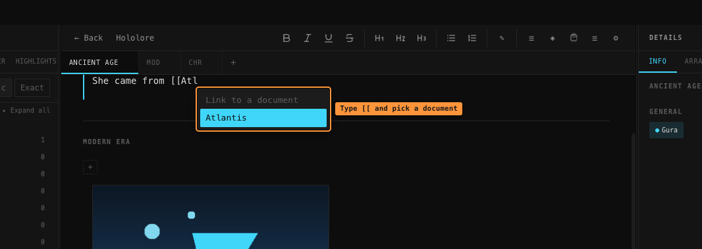
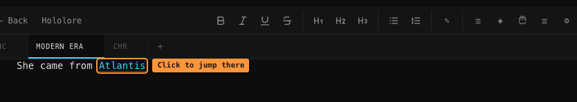
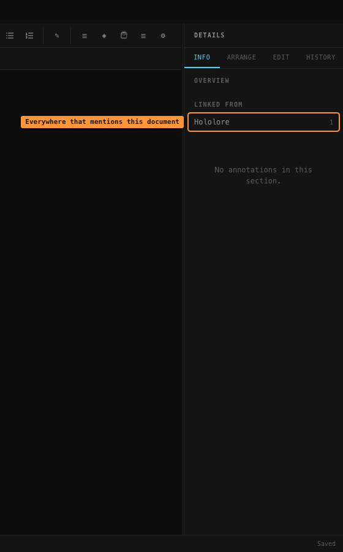
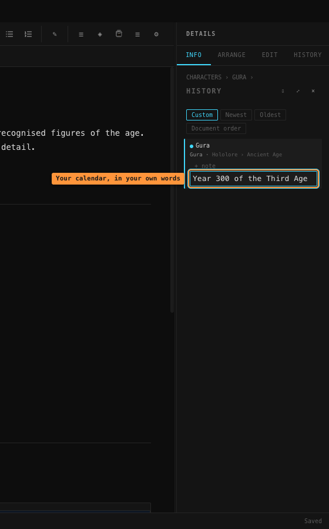
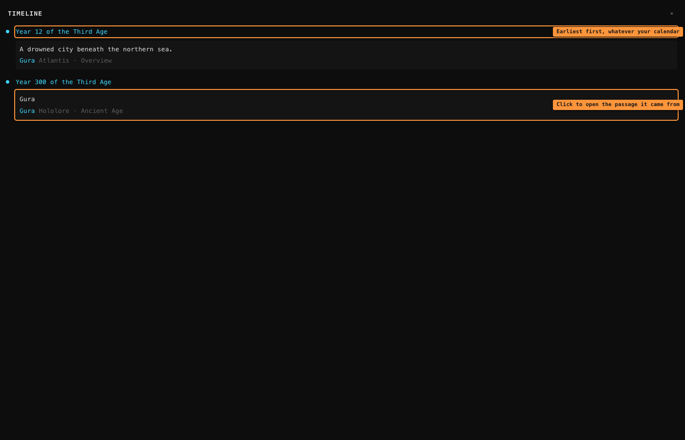

# Links and the timeline

Two ways of connecting what you've written that don't go through tags: **links** between
documents, and a **timeline** of everything you've dated.

## Linking one document to another

While writing, type `[[`. A list of your other documents appears — keep typing to narrow it,
then press **Enter** (or click) to insert the link.

Pick one and the brackets and half-typed name are replaced by the link itself:

The link is one clickable thing, not styled text. Click it and that document opens.

**A link points at the document, not at its name.** Rename `GURA` to `GAWR GURA` and every
link to her updates by itself — you never have to go back and fix your writing. If the
document is deleted, the link stays as greyed-out text so the sentence still reads, rather
than vanishing.

Use **↑ / ↓** to move through the list, **Enter** or **Tab** to pick, **Escape** to dismiss
it and carry on typing ordinary brackets.

The list never offers the document you're currently in.

## Linked from

Open a document and look at the **Info** tab in the right sidebar. If anything links to it,
a **Linked from** list appears, with a count of how many times each one mentions it. Click a
row to go there.

This is the half of a link you didn't write. Standing on GURA, the useful question is
usually *what mentions her* — and that's what this answers.

> Links are read from your saved writing, so a link you just typed shows up here a moment
> later, once the section saves.

## The timeline

World-building accumulates dates scattered across whichever document you happened to be
writing in. The timeline is where they line up.

### Dating something

Any filed excerpt can be given a **when**:

1. Open the category page holding the excerpt (see [Filing](filing-and-graph.md)).
2. Under the excerpt, click **+ when**.
3. Type when it happened. Press **Enter**.

### It's your calendar, not ours

The field is free text on purpose. All of these work:

| What you type | Where it lands |
|---|---|
| `Year 300 of the Third Age` | year 300 |
| `1885-03-12` | that date |
| `12 March 1885` | the same date |
| `-450 BE` | 450 years before year 0 |
| `Age of Ash, 12` | year 12 |
| `long ago` | **Undated**, at the end |

TotoNote reads the first number it finds and sorts by that, and always shows back exactly
what you typed. Anything with no number in it isn't guessed at — it gathers under
**Undated** at the bottom, where you can still see it.

### Reading the timeline

Click **⌚** in the toolbar. Everything dated appears earliest first, grouped by moment,
across every document in the current workspace. Each entry shows the excerpt, its tag, and
which document and section it came from.

Click one to jump to that passage. **Escape** closes the timeline.

---

See also: [Filing and the graph](filing-and-graph.md) — the graph draws connections between
categories and tags, while the timeline orders events in time.
