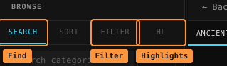
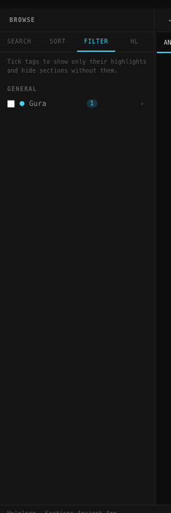
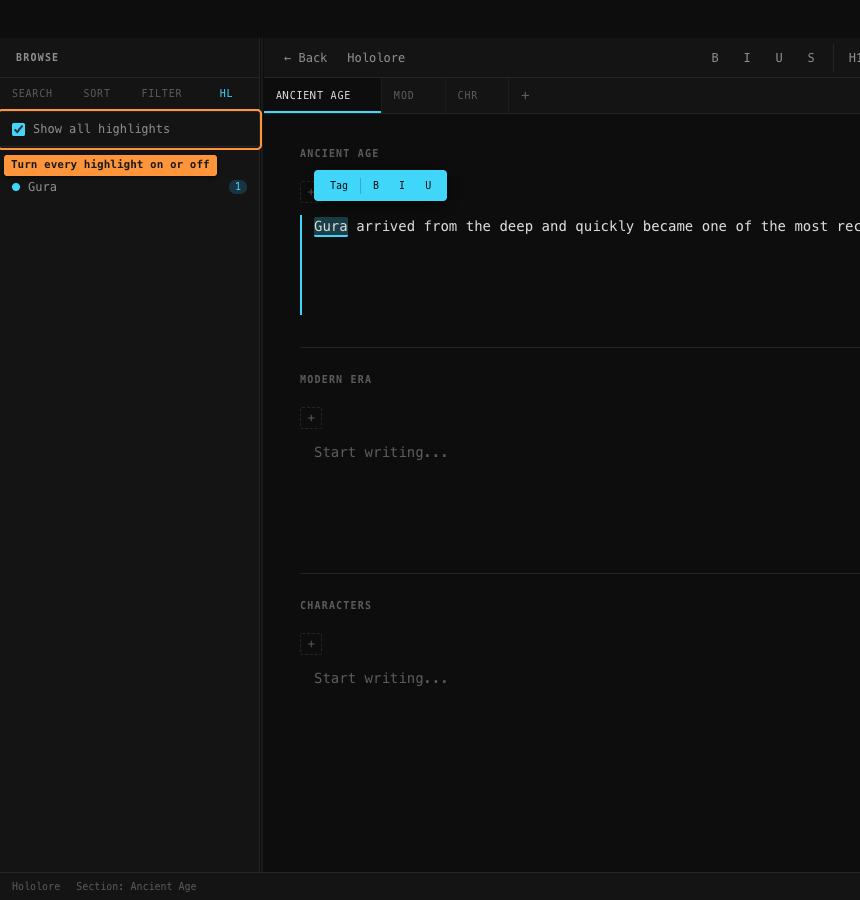

# Search and filters

The left sidebar is called **Browse**. It has four modes:

## Search

Type in the box and it looks through your **category names**, **tag names** and **tag
descriptions**. Matching categories open up on their own; anything with no match is hidden.

If a *category* name matches, all of its tags are shown, with the ones that didn't match
themselves dimmed.

### The "Exact" button

Off by default. It changes how forgiving the matching is:

- **Off** — typos are tolerated. `iris` will find `IRyS`. The longer your search, the more
  slack you get.
- **On** — the text must actually contain what you typed, letter for letter (capitals
  still don't matter).

> Despite the name, "Exact" doesn't mean the whole name has to match — it means "contains
> exactly this", as opposed to "something roughly like this".

> Searching a **single letter** with Exact off matches nearly every tag. Type two or more
> and it behaves properly.

## Filter

Tick tags here to **show only those highlights and hide everything else**. Two things
happen at once:

- Only the ticked tags' highlights stay coloured in; the rest disappear until you clear
  the filter.
- Sections that don't use any of the ticked tags are hidden (their tabs too).

That means Filter does something visible even in a single-section document, where hiding
sections alone would do nothing.

Ticking several tags widens the net — you see every ticked tag's highlights, and every
section using *any* of them.

If nothing matches you'll see *"No sections match the active filters."* in the middle of
the window. **Clear filters (N)** at the top puts everything back.

> **Clear filters also empties the Search box.** If your search text vanishes, that's why.

Clicking anywhere on a row ticks it. The small **›** at the row's end opens the tag's
details instead.

## HL — highlights

**Show all highlights** at the top turns every highlight off or on at once, so you can
read your writing plain. Below it, **each tag has its own tickbox** — untick one to hide
just that tag's colouring and leave the rest alone. Nothing is ever deleted; tick it back
and the colours return.

## Sort

Four buttons — Name A-Z, Name Z-A, Date (Oldest), Date (Newest).

> **These don't do anything yet.** The button highlights when clicked but nothing is
> actually re-sorted. It's unfinished, not broken on your machine.

## Clicking things

Clicking any tag anywhere in the Browse sidebar opens its page in the right-hand
**Info** panel — usage counts, every phrase it's attached to grouped by where it's filed,
and a form to edit it. In Search mode, clicking a **category's name** opens that
category's compiled page — see [Filing and the graph](filing-and-graph.md).

Once you've clicked one, **↑** and **↓** move through the list. **Escape** clears the
selection.

Right-clicking a tag gives you **View Details** and **Delete**.
