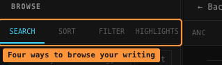
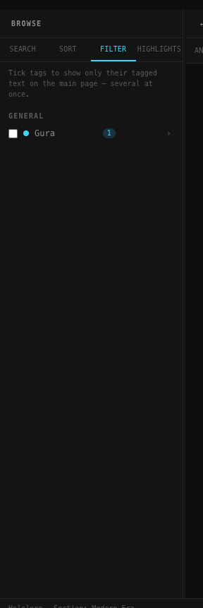
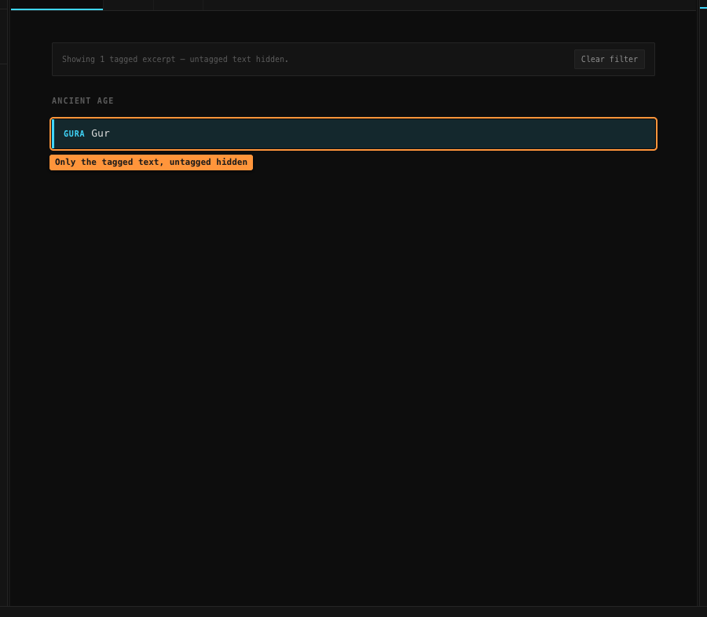
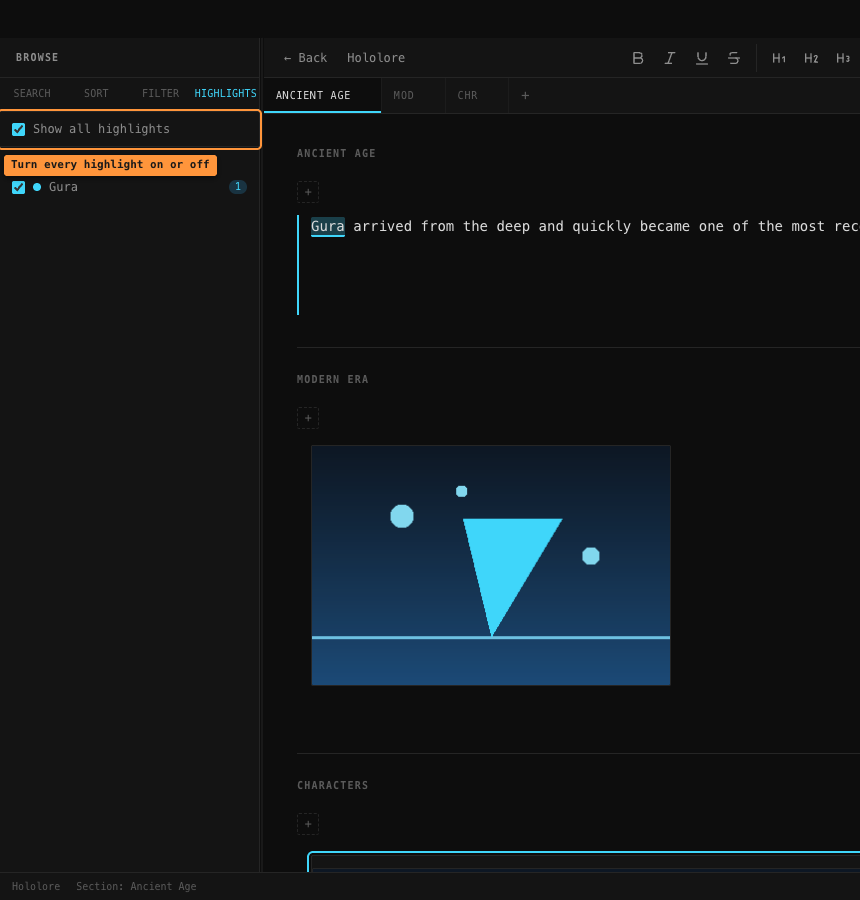
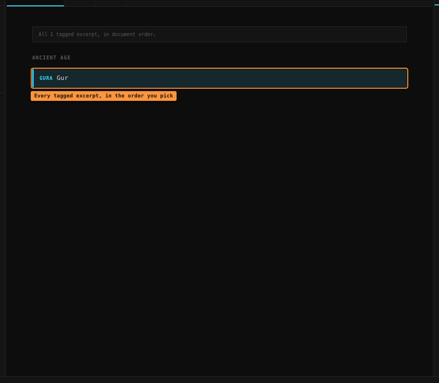

# Search and filters

The left sidebar is called **Browse**. It has four modes:

## Search

Type in the box and it looks through your **category names**, **tag names** and **tag
descriptions**. Matching categories open up on their own; anything with no match is hidden.

If a *category* name matches, all of its tags are shown, with the ones that didn't match
themselves dimmed.

With the box empty you're browsing the whole tree. Click a category to open or close it,
or use **▸ Expand all / ▾ Collapse all** above the list to open or close every category at
once.

### The "Exact" button

Off by default. It changes how forgiving the matching is:

- **Off** — typos are tolerated. `iris` will find `IRyS`. The longer your search, the more
  slack you get.
- **On** — the text must actually contain what you typed, letter for letter (capitals
  still don't matter).

> Despite the name, "Exact" doesn't mean the whole name has to match — it means "contains
> exactly this", as opposed to "something roughly like this".

> Searching a **single letter** with Exact off matches nearly every tag. Type two or more
> and it behaves properly.

## Filter

Ticking tags here turns the **main page into a reading view of just those tags' passages**.
Everything untagged is hidden, so what's left is only the text carrying the ticked tags,
in order — and you can tick several tags to read them together.

Each passage is shown with its tag's colour. **Double-click one to clear the filter and
jump to that passage** in the editor, ready to edit. **Clear filter** (top of the view, or
the button in the sidebar) returns to normal editing.

This is different from the tag/category pages in the right sidebar: those list one tag or
one category's excerpts; Filter shows *several tags at once* right on the main page.

> **Clear filters also empties the Search box.** If your search text vanishes, that's why.

Clicking anywhere on a row ticks it. The small **›** at the row's end opens the tag's
details instead.

## Highlights

**Show all highlights** at the top turns every highlight off or on at once, so you can
read your writing plain. Below it, **each tag has its own tickbox** — untick one to hide
just that tag's colouring and leave the rest alone. Nothing is ever deleted; tick it back
and the colours return.

## Sort

Sort turns the main page into a reading list of **every tagged excerpt in the document**,
in whatever order you pick:

- **Document order** — top to bottom, section by section, as they appear in your writing.
- **Newest first** / **Oldest first** — by when you tagged them.
- **Grouped by tag** — gathered under each tag's name.

It's the whole-document counterpart to Filter: Filter narrows the page down to the tags you
tick, Sort shows *all* of them, ordered. Like Filter it's a reading view — your writing is
untouched underneath, and **double-clicking an excerpt jumps to it** in the editor.

## Clicking things

Clicking any tag anywhere in the Browse sidebar opens its page in the right-hand
**Info** panel — usage counts, every phrase it's attached to grouped by where it's filed,
and a form to edit it. In Search mode, clicking a **category's name** opens that
category's compiled page — see [Filing and the graph](filing-and-graph.md).

Once you've clicked one, **↑** and **↓** move through the list. **Escape** clears the
selection.

Right-clicking a tag gives you **View Details** and **Delete**.
