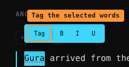
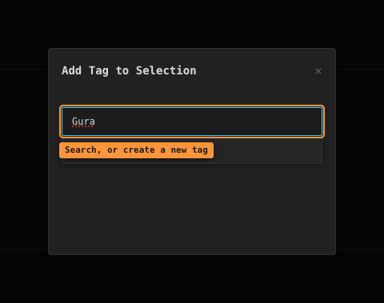
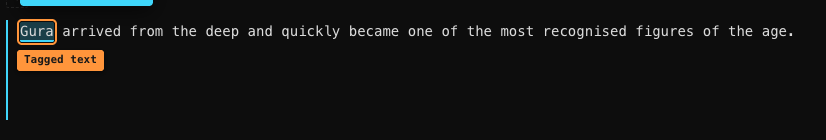
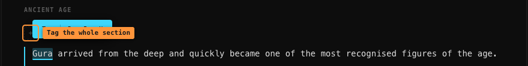

# Tags and highlights

A **tag** is a label with a colour — `Gura`, `Ancient Temple`, `Betrayal`. Tags live inside
[categories](categories-and-rules.md), and you attach them to your writing in two ways:

- to **a specific piece of text**, which colours it in — this guide calls that a
  **highlight**;
- to **a whole section**, which shows up as a small badge above that section.

## Highlighting a piece of text

Select some words. A small bar appears just above them:

The **B**, **I** and **U** buttons are ordinary formatting. **Tag** is the one that
attaches a tag.

Click **Tag** and a search box opens:

Start typing. Existing tags are listed as you type — click one, or use ↑ / ↓ and Enter.
The **+ Create new tag** button above the search box makes a brand-new tag instead.

The **File under** dropdown underneath is optional — it places the excerpt on one of your
category pages at the same time. See [Filing and the graph](filing-and-graph.md).

If nothing matches, an extra row appears offering **`+ Create "<what you typed>"`**. Pick
it and you get a small form for the new tag — name, category and colour — with a
**Create & Tag** button that makes the tag *and* applies it in one step.

Either way, the text is now coloured in:

> You can also **right-click** selected text and choose **Add tag to selection**. That
> route only offers tags that already exist — it has no create option.

## Working with an existing highlight

**Click** it to see a small popup with the tag's name, its category, and its description.

**Right-click** it for the full menu:

| Option | What it does |
|--------|--------------|
| **Remove annotation** | Removes the highlight. Immediate, no confirmation. Your text is untouched. |
| **File under…** | Places the excerpt on a category page — see [Filing and the graph](filing-and-graph.md) |
| **Expand to selection** | Stretches the highlight to cover your current selection too |
| **Shrink to selection** | Trims it down to just the overlapping part |
| **Split at selection** | Cuts it into two highlights, one either side of your selection |
| **Combine with: …** | Merges it with a neighbouring highlight |
| **Add another tag to selection** | Puts a second tag over the same words |

Expand, shrink, split and combine only show up when they make sense — you need a selection,
or a neighbour close enough to merge with.

> **Combining keeps the tag of the highlight you right-clicked** and discards the other
> one. If you combine a `Gura` highlight with a `Betrayal` one, you end up with `Gura`.

## Tagging a whole section

Above each section's text there's a thin strip. The **`+`** on the right adds a tag to the
entire section:

This one only offers tags that already exist — you can't create a new tag from here. Each
applied tag shows as a badge with a small **×** to take it off again.

Section tags are what the **Filter** mode matches on, along with highlights. See
[Search and filters](search-and-filters.md).

## Editing or deleting a tag

Click any tag in the left sidebar. The right-hand panel switches to **Info** and shows
that tag: how often it's used, every highlighted phrase grouped by where it's filed
(click one to jump to it), and a form to change its **name**, **description**, **category**
and **colour**. **Edits save themselves** — there is no Save button; the panel says so and
flashes *Saved ✓* as you go.

Deleting a tag — from the sidebar's right-click menu or the Info panel's Delete button —
asks you to confirm, then shows an **Undo** button for a few seconds in case you change
your mind. It removes that tag **everywhere** — in every document, not just the one you
have open — and all of its highlights go with it (your text stays, only the colouring
goes).
