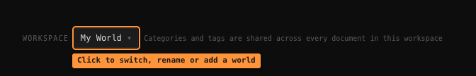

# Workspaces

A **workspace** is a world. Everything lives inside one: your documents, and the whole
category and tag structure that goes with them.

Two workspaces don't see each other. `Game 1` can have its own `CHARACTERS` tree, and
`Game 2` can have a completely different one with the same name, with no overlap.

## Switching, creating, renaming

The bar sits above your documents. Click the workspace name to open the menu:

- **Any workspace in the list** — switch to it. Your documents and categories change with it.
- **+ New workspace** — start an empty one. It becomes active straight away.
- **Rename "…"** — rename the one you're in.
- **Delete "…"** — remove it and everything inside. You can't delete your last one.

> **Deleting a workspace cannot be undone**, and it takes every document, category, tag
> and highlight inside it. The confirmation says so. Back up first — see the
> [FAQ](faq.md#how-do-i-back-up).

## What's shared, and what isn't

Inside one workspace, **categories and tags are shared across all of its documents**.
That's deliberate: it's what lets a category page collect excerpts from every document
at once — see [Filing and the graph](filing-and-graph.md).

Between workspaces, nothing is shared.

| Thing | Scope |
|-------|-------|
| Documents | One workspace |
| Categories and their rules | One workspace |
| Tags | The category they live in, so one workspace |
| Highlights and filings | The document they're in |

## Upgrading from an older version

Everything you already had was moved into a workspace called **My World** the first time
you opened this version. Nothing was lost or reorganised — it's all exactly where it was,
now with a workspace around it.
